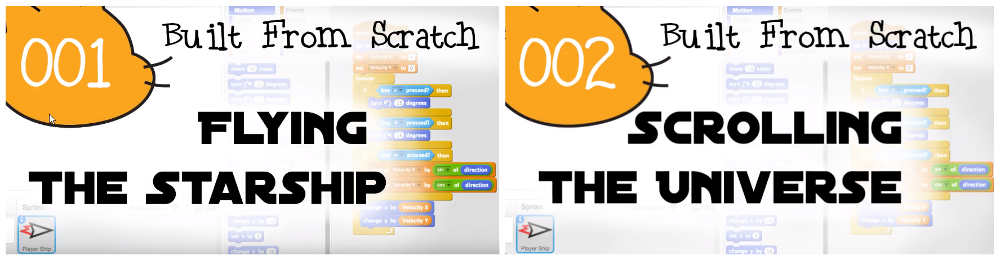

"Built From Scratch" is a series of short tutorial videos documenting the design and programming of a video game project using the Scratch programming language.  

While many resources and tutorials exist for beginner programmers, they tend to focus on the act of writing code to solve problems and accomplish specific goals.  While these resources are tremendously helpful, they tend to focus on product rather than process and teach the skills involved in constructing software in isolation from the skills involved in designing it.

By watching a step-by-step walk-through and discussion of the process of both designing and creating a medium-scale, complex project, viewers can learn not only how to produce code that does specific things but how to think about this code in the context of larger projects and goals.

[Watch it here!](http://www.builtfromscratch.net)
