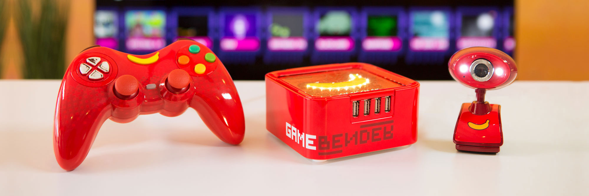
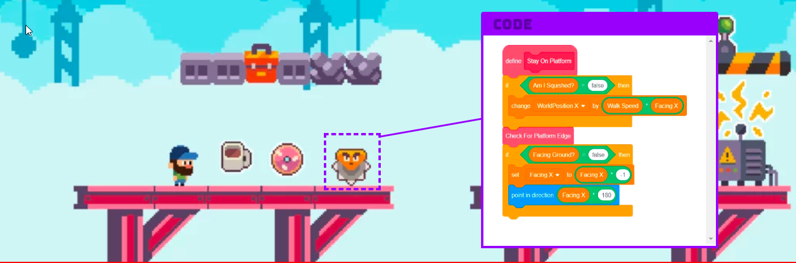

GameBender is a radical new game console, where you modify ("bend") games while you play them. It unleashes wild creativity during gameplay, and allows a path into coding that looks more like a party or an art class and less like homework.

GameBender was primarily designed as a video-game console and a consumer product.  I joined the team in the summer of 2019, three years into the project's development, to work on adapting the GameBender console software for use in formal and informal educational settings -- classrooms, museums, afterschool clubs, community centers, and more.

Because JoyLabz is a small organization, this work has touched on all aspects of the project.  I began by developing curricular material for teachers -- programming prompts, sample code, and projects designed to be modified and built using the GameBender coding toolset.  

Through the process of designing these curricular materials we were able to see that certain fundamental aspects of the project needed to be redesigned to move from the consumer audience to an educational one.  Consequently, my role on the project has shifted to become a combination of UI/UX design and product ownership -- working with the design team to define the features we need for an educational release, translating these needs into user stories and design documents for the software development team.
