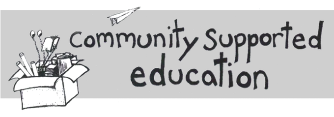
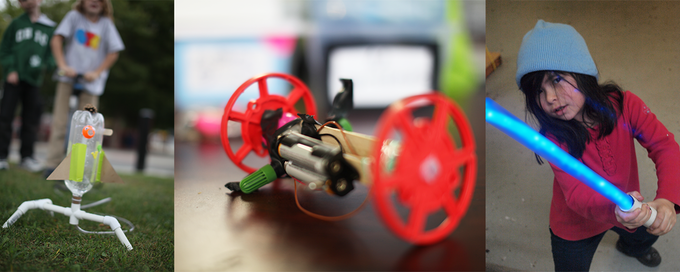
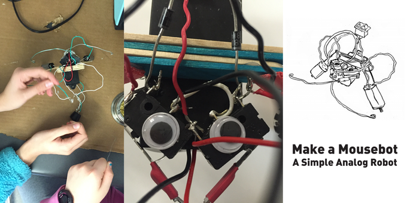
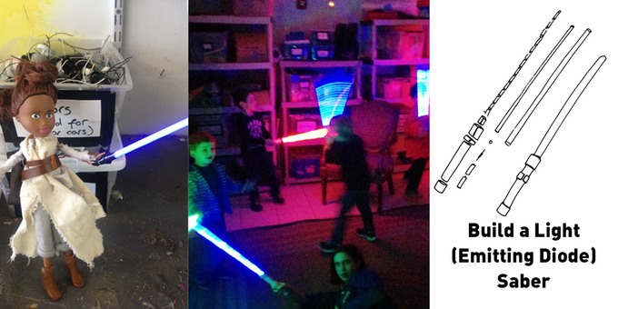

The Parts and Crafts Kits Initiative was a combination fundraiser and documentation-push.  One of our big struggles with Parts and Crafts has been finding ways to fund the production and distribution of high-quality project documentation and educational resources.  By producing and selling [Kickstarter-funded DIY project kits](https://www.kickstarter.com/projects/1853870446/parts-and-crafts-monthly-make-it) we were able to fund the design and development of a number of low-cost, open-hardware, Creative Commons licensed educational project kits.

Most kits produced for children and education optimize their components for creating an easy-to-build product and a streamlined building experience.  This makes these projects easy for beginners to successfully build but it also limits the value of building them.  What does it really mean to be able to put together a kit if the kit consists of precise laser-cut and vacuum-formed parts that you wouldn't know how to design or build on your own?

All of our projects are built from readily available, low-cost materials and can be manufactured with a minimal tool-set.  All of the parts for the kits can be built by hand with not much more than a saw, a drill, and a pair of pliers.  Because the parts that make up the kit are understandable and reproducible, the builder learns not just how to follow instructions and build a specific object, but more generally learns how certain kinds of tools and materials can be used to make things more generally.  The simplicity and imprecision of the components invites the builder not only to reproduce them but also to imagine what else they could be used for.

Written documentation for all of our kit projects can be found at the [Make-It Wiki](http://partsandcrafts.org/makeit) and step-by-step video tutorials for many projects are available on our [Youtube Channel](https://www.youtube.com/playlist?list=PLDDuJqQ3AjnZKgw1sYJx4_a8sziZCeW8D).
