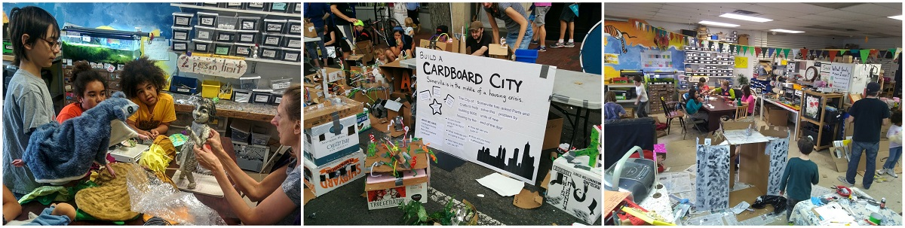
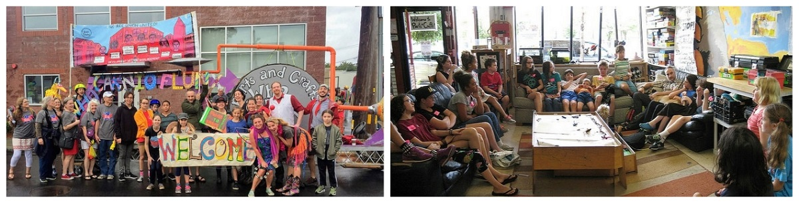
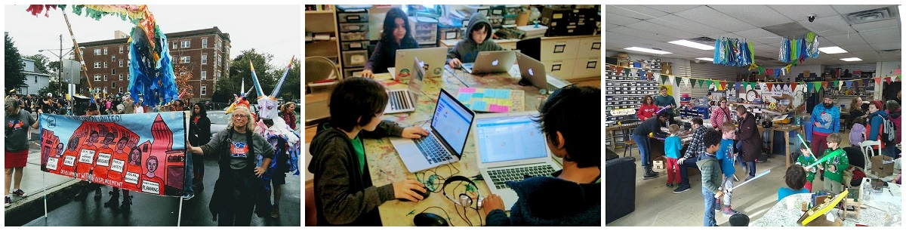

In the winter of 2009 I began planning a small summer-camp program for kids with focused on independence, kid-choice, project-based learning, and playful and creative use of tools and technology.  That summer we managed to have two staff members and between four and six kids making circuits and baking bread and programmign computers in a small church basement in Brookline for most of the summer.

Over the years we've slowly and organically grown our programming and community.  Summer camp now serves around 65 kids per week and has a staff of 12.  We've become a 501(c)(3) non-profit corporation with an annual budget of approximately $500,000.  All told we have grown to serve approximately 1200 kids/year with a year-round full-tme core staff of 6 co-directors.  

During the school year we run the [Center for Semi-Conducted-Learning](https://www.partsandcrafts.org/alternative-school/), a full-time school-alternative program as well as our [afterschool makerspace program](https://www.partsandcrafts.org/afterschool/), both for kids ages 7 to 14.  In our space we also run drop-in [community open-shop](https://www.partsandcrafts.org/makerspace/open-shop/) hours for people of all ages.  

We collaborate with the Somerville Public Schools to run a [makerspace classroom at Next Wave/Full Circle](https://www.partsandcrafts.org/makerspace/next-wave-full-circle/), Somerville's public alternative middle/high-school and with the city's Office of Strategic Planning and Community Development to manage [FabVille](https://www.fabville.net/), a free and publically accessible community Fab Lab housed in Somerville High School.  In addition to our on-site programs we run in-school STEAM classes in schools as well as travelling afterschool and weekend workshops with local community centers including a week-long STEAM summer camp for immigrant teens at the Mystic Public Housing Development in collaboration with [The Welcome Project](https://www.welcomeproject.org/).

You can learn more at the [Parts and Crafts website](https://www.partsandcrafts.org).  Including ["How We Do It"](https://www.partsandcrafts.org/about-us/theory-and-philosphy/how-we-do-it/), and ["Our Manifesto"](https://www.partsandcrafts.org/about-us/theory-and-philosphy/making-things-and-making-things-happen/).

Or you can peruse our annual reports below:
- [2017 Annual Report](/reports/2017 annual report.pdf)
- [2016 Annual Report](/reports/2016 annual report.pdf)
- [2015 Annual Report](/reports/2015 annual report.pdf)
- [2014 Annual Report](/reports/2014 annual report.pdf)

