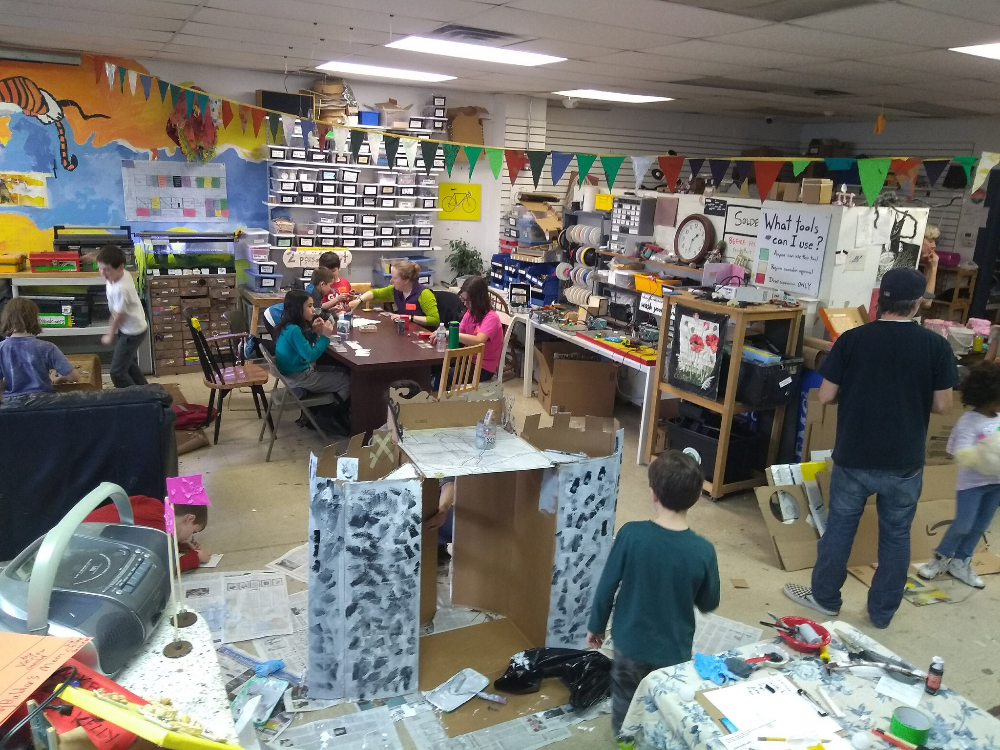
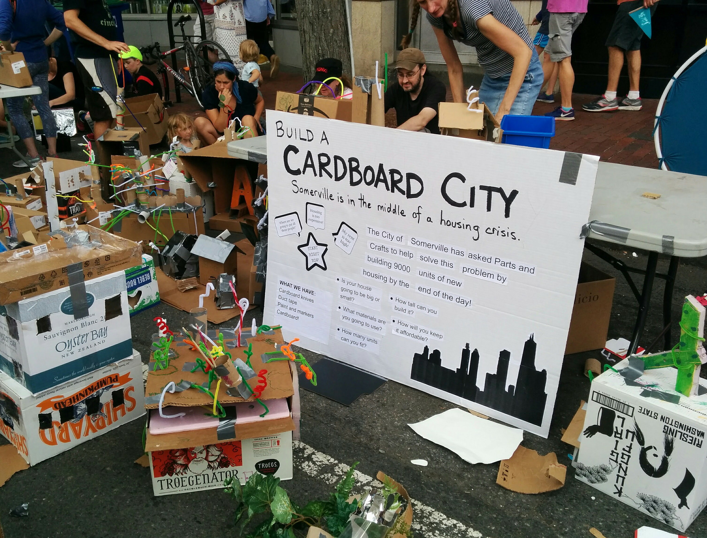

  
  
  
  

In the winter of 2009 I began planning a small summer-camp program for kids with focused on independence, kid-choice, project-based learning, and playful and creative use of tools and technology.  That summer we managed to have two staff members and between four and six kids making circuits and baking bread and programmign computers in a small church basement in Brookline for most of the summer.

Parts and Crafts was one of the first makerspaces focused on youth and education and it has been thrilling and inspiring to see hackerspaces grow into makerspaces and to watch those in turn grow into the “make movement.”  Cultural change is slow moving, especially in an education system still primarily influenced by the presence and design of high-stakes standardized tests, but this movement towards creative technology and hands-on projects continues to gain momentum.  We are beginning to see teachers, administrators as well as parents and kids taking making and tinkering seriously as forms of inquiry as well as acknowledging and embracing the fact that a lot of important learning happens outside of schools in after-school programs, community centers, and peer networks. 

Over the years we've slowly and organically grown our programming and community.  Summer camp now serves aroudn 65 kids per week and has a staff of 12.  We've become a 501(c)(3) non-profit corporation with an annual budget of approximately $500,000.  All told we have grown to serve approximately 1200 kids/year with a year-round full-tme core staff of 6 co-directors.  

Our work here is extremely local, but very broad.  We are a part of our city and our community and our programs bridge the gap between formal and informal learning.  We run a space that houses a variety of programs for kids during the school day, after school, and on the weekends.  In addition to our on-site programs we run in-school STEAM classes in schools as well as travelling afterschool and weekend workshops with local community centers.  We run a week-long STEAM summer camp for immigrant teens at the Mystic Public Housing Development.  We partner with Somerville High School and the Somerville Office of Strategic Planning and Community Development to offer drop-in open-shop hours as well as workshops and training in digital fabrication for teens and adults through Somerville’s FabLab.  We collaborate regularly on tool, program, and  and curriculum development with local research organizations including the Lifelong Kindergarten Group at the MIT Media Lab, and Public Laboratory for Open Technology and Science.  

As the founder and co-director for almost 10 years I have designed, implimented, and run (with an enormous amount of support from my colleagues and co-directors) every aspect of the organization, from teaching to project, curriculum, program, and space design, from IT to scheduling to project-management to accounting in a fast-paced and extremely collaborative environment.
 

You can learn more at the [Parts and Crafts website](https://www.partsandcrafts.org).  [How We Do It](https://www.partsandcrafts.org/about-us/theory-and-philosphy/how-we-do-it/).  [Our Manifesto](https://www.partsandcrafts.org/about-us/theory-and-philosphy/making-things-and-making-things-happen/).

